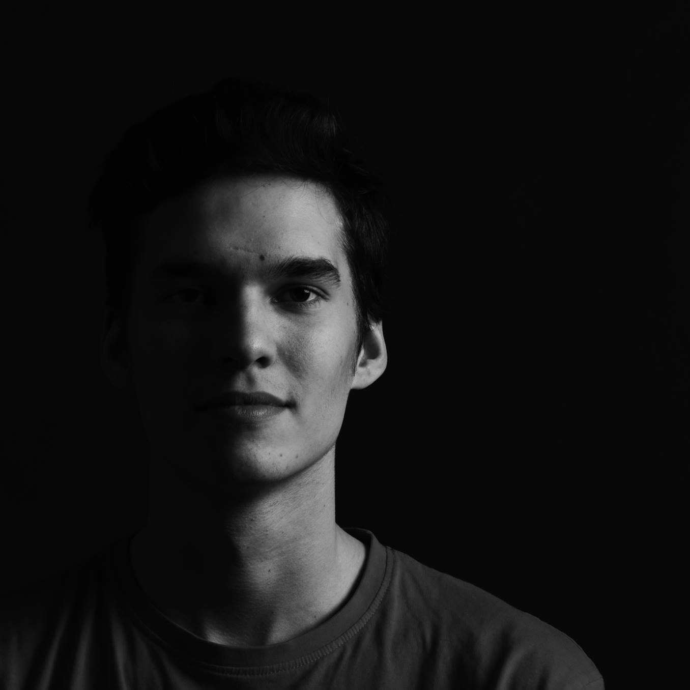

# Hi, my name is Filip.

Currently, Im a student at VŠKK university in Prague. My study of graphic design has been going on for 7 years, and will continue until there is no knowledge left.

As of work speaking, freelancing is the main way. In my opinion, I have done a real broad field of work, so Im not affraid and excited to see, what you want to create!

I enjoy and preferably work in Adobe Creative Cloud. Lately i have been working in Figma, which I really enjoy. As a graphic designer, im kind of obligated to work in this enviroment. But it doesn’t bother me, Im used to it and have studied my whole time in these, so I can label myself as kind of oriented in this. In meantime and if the works requieres it I work with my iPad in Procreate, that lets me draw on free will, like on paper!

# Havas project

 
 

